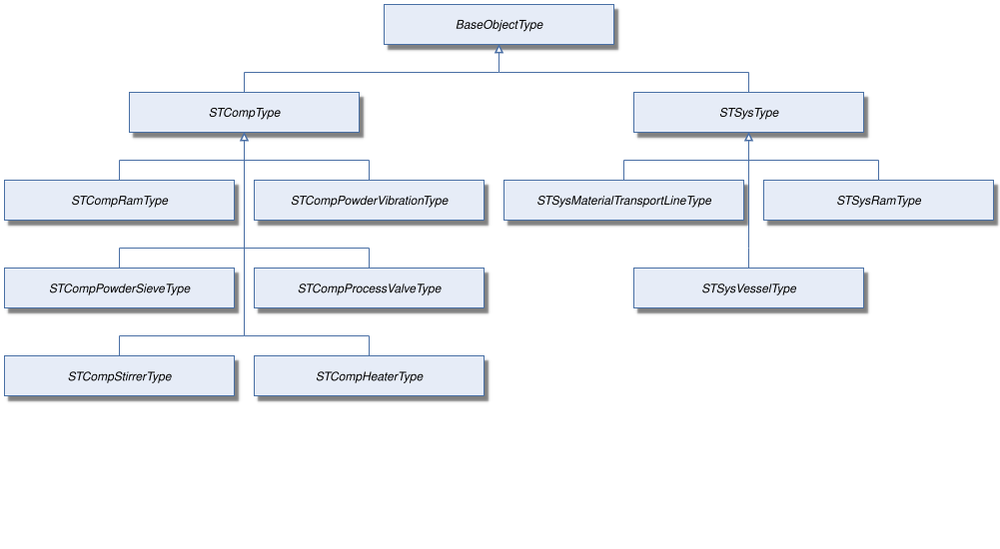
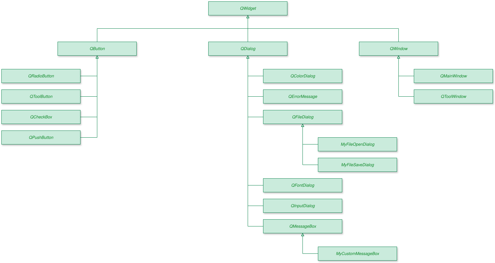

<!-- SPDX-FileCopyrightText: 2026 Gerhard Gappmeier <gerhard.gappmeier@ascolab.com> -->
<!-- SPDX-License-Identifier: GPL-3.0-only -->

# OPC UA Diagram Generator

This repository renders OPC UA type hierarchies as SVG files. The input is a
simple text file inspired by PlantUML WBS input, but the code does not use
PlantUML. It is pure Python and does not require Java or a PlantUML JAR.

`rsvg-convert` is required only for PNG generation. It converts the generated
SVG into a raster PNG and preserves SVG filters such as node shadows.

## Why?

Standard tools like Graphviz, PlantUML, and Mermaid are not able to render the
OPC UA type hierarchies with the layout and style required by the OPC
Specification. The graphical notation for OPC UA specifications is defined
in [OPC UA Part 3, Annex C](https://reference.opcfoundation.org/specs/OPC-10000-3/annex-c).

### A Typical OPC UA Type Hierarchy



### An OPC UA Collaboration Diagram

This diagram shows a BoilerType and two instances to get a more complex
collaboration diagram.



## Installation

Python 3 is required to render SVG files. `rsvg-convert` is additionally
required only for PNG generation. On Debian or Ubuntu, install both with:

```sh
sudo apt install python3 librsvg2-bin
```

On Fedora:

```sh
sudo dnf install python3 librsvg2-tools
```

On Windows, Python can be installed with WinGet from PowerShell:

```powershell
winget install -e --id Python.Python.3.11
```

The Python renderer does not require PlantUML, Java, or GNU Make. PNG output
additionally requires `rsvg-convert`. On Windows, the simplest way to use
`rsvg-convert` and the bundled Makefile is through WSL. Install Debian from an
elevated PowerShell prompt, then run the Debian commands inside the WSL
terminal:

```powershell
wsl --install -d Debian
```

After restarting WSL:

```sh
sudo apt update
sudo apt install python3 librsvg2-bin make
```

You can use the Linux instructions below now also on Windows inside WSL.

## Usage

Render one diagram directly in a Linux shell:

```sh
./tree2svg.py opcua.puml -o opcua.svg
```

On Windows using PowerShell, you can use it like this:

```powershell
python tree2svg.py opcua.puml -o opcua.svg
```

The bundled Makefile demonstrates how to build multiple diagrams easily from
source. GNU Make also ensures that only diagrams whose input has changed are
regenerated.

```sh
make
```

Other targets:

```sh
make svg       # generate SVG files
make png       # generate *.png files
make clean     # remove generated files
```

The renderer supports arbitrary hierarchy depth. Branches grow outward
from the root, siblings are stacked vertically, and left/right connectors are
mirrored.

## Input

The input uses a type-system section with PlantUML WBS-style depth markers. Each
node may start with one of the supported node classes: `obj`, `objtype`, `var`,
`vartype`, `method`, `reftype`, `datatype`, or `view`. If the class is omitted,
it defaults to `objtype`.

Blank lines between root-level groups separate columns. Nodes in the same group
are stacked vertically in that column.

When the reference type is omitted, it is inferred as follows: an object to an
object type uses `hasTypeDefinition`, an object to an object uses
`hasComponent`, an object or object type to a variable uses `hasProperty`, and
all other relationships use inheritance. Put an explicit reference type before
the node class when a different relationship is required.

```text
@starttypesystem
* obj "Root"
** Organizes obj "Objects"
*** Organizes var "Temperature"
** Organizes obj "Types"
** Organizes obj "Views"
@endtypesystem
```

Node styling is read from the relevant `skinparam` settings. Shadows are
mandatory for type nodes and are not configurable; instance nodes do not have
shadows.

The minimum node width defaults to 230 pixels and can be changed with
`skinparam nodeMinWidth 180`. Nodes expand beyond that width when their labels
need more space.

Instance nodes use a white-to-gray gradient and type nodes use `#e8eef7` by
default. These colors can be customized with `InstanceFill`, `InstanceFillEnd`,
and `TypeFill` inside `skinparam node { ... }`.

Line and border thickness defaults to 1.3 and can be changed with
`skinparam nodeStrokeWidth 2`.

## License

The renderer is licensed under the GNU General Public License, version 3 only.
The example diagram and its generated files are licensed under the MIT License.
See [LICENSE](LICENSE) and [LICENSES](LICENSES) for the complete license texts.
